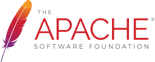

#  안녕하세요

### 백승화의 깃허브입니다 : )


[](mailto:maga32@naver.com)

[](https://sung-a.duckdns.org)
<p align="left"> </p>

<br>

# :computer: Interesting
* Java 웹개발
* php 서비스개발
* Android 개발
* ios 개발
* 음성 및 음향관련 데이터

<br>

# :hammer: Develop Environment

<table>
<tr>
	<td>Language</td>
	<td colspan='2'>
		
		
		  
		
		
	</td>
</tr>
	
<tr>
<td>Framework<br>& Library</td>
	<td>
		
		
		
	</td>
	<td>
		 
	</td>
</tr>
	
<tr>
	<td>Database</td>
	<td colspan='2'>
		
		
		
	</td>
</tr>
	
<tr>
	<td>Server<br>(software)</td>
	<td>
		
		
	</td>
	<td>
		
	</td>
</tr>

<tr>
	<td>Server<br>(hardware)</td>
	<td colspan='2'>
		
		
		
		
		
	</td>
</tr>
	
<tr>
	<td>Configuration<br>Management</td>
	<td colspan='2'>
		
		
		
	</td>
</tr>
</table>

<br>

## :question: Who am I
```java
class WhoAmI {
	String name = "백승화";
	String current_work = "개발자";
	String[] hobbies = {
		"음악 감상",
		"친구들과의 음주가무",
		"웹 기능 구현하기"
	};
	
	String getCity(String name){
		return "서울";
	}
	
	ArrayList<String> getAmbitions(String name){
		ArrayList<String> ambitions = new ArrayList<String>();
		ambitions.add("개인 운영 사이트들 완성하기");
		ambitions.add("정보처리기사 준비");
		ambitions.add("포트폴리오 정리하기");
		ambitions.add("내집 마련하기");
		
		return ambitions;
	}
}
```

<br>

## :pencil2: Current Works
 * java - 개인 cloud만들기 작업중
 * php - 서버 db연동 엑셀데이터 추출 작업중

<br>

## :guitar: ETC.

